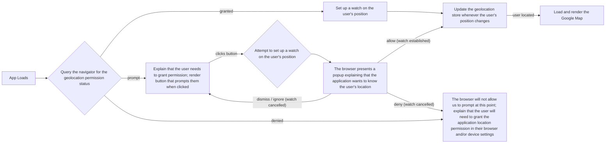

# Shield AI

### A Naïve Approach

```tsx
// routes/naive.tsx
const Component = () => {
  const [query, setQuery] = useState('');
  return (
    <main>
      <PageTitle />
      <InputLabel />
      <input
        aria-label="query"
        aria-labelledby="query-label"
        id="query-input"
        onChange={({ target: { value } }) => setQuery(value)}
        type="text"
        value={query}
      />
      <Table />
    </main>
  );
};
```

- State is defined at the root of the component tree
- Everything re-renders even though only the input element cares about the state
- It works, but it’s not best practice
- In a complex application, the UI will be noticeably laggy

### A Better Approach

```tsx
// routes/better.tsx
const QueryInput: FC = () => {
  const [query, setQuery] = useState('');
  return (
    <input
      aria-label="query"
      aria-labelledby="query-label"
      id="query-input"
      onChange={({ target: { value } }) => setQuery(value)}
      type="text"
      value={query}
    />
  );
};

const Component = () => {
  return (
    <main>
      <PageTitle />
      <InputLabel />
      <QueryInput />
      <Table />
    </main>
  );
};
```

- State has been moved as far down the component tree as possible, to a leaf node
- Only the input element re-renders
- Real applications aren’t this simple though; state is usually needed by more than a single leaf node

### A Realistic Scenario

```tsx
// routes/realistic.tsx
const Component = () => {
  const [query, setQuery] = useState('');
  return (
    <main>
      <PageTitle />
      <InputLabel />
      <input
        aria-label="query"
        aria-labelledby="query-label"
        id="query-input"
        onChange={({ target: { value } }) => setQuery(value)}
        type="text"
        value={query}
      />
      {!!query
        && (
          <p>
            {`${query} has won ${data.reduce<number>(
              (pv, cv) => cv.Champion === query ? pv + 1 : pv,
              0,
            )} championships.`}
          </p>
        )}
      <Table />
    </main>
  );
};
```

- State has been moved as far down the component tree as possible while still being accessible to the components which need it
- But we have the same problem we did at first; components that don’t care about the state now re-render whenever it changes
- In this case, because the elements are adjacent siblings, we could create a new component that defines the state and contains the input element and p tag wrapped in a fragment
- This would restrict the page’s design though; it isn't always (in fact, it usually isn't) possible to keep state defined only in leaf nodes.

### React.memo

```tsx
// routes/memoized.tsx
const MemoizedTable = memo(
  () => {
    console.log('rendering "MemoizedTable"');
    return (
      <div>
        <table>
          <caption>
            NCAA football national champions
          </caption>
          <thead>
            <tr>
              <th>
                Season
              </th>
              <th>
                Champion
              </th>
            </tr>
          </thead>
          <tbody>
            {data.map((cv) => <TableRow key={`${cv.Season}${cv.Champion}`} {...cv} />)}
          </tbody>
        </table>
      </div>
    );
  },
);

const Component = () => {
  const [query, setQuery] = useState('');
  return (
    <main>
      <PageTitle />
      <InputLabel />
      <input
        aria-label="query"
        aria-labelledby="query-label"
        id="query-input"
        onChange={({ target: { value } }) => setQuery(value)}
        type="text"
        value={query}
      />
      {!!query
        && (
          <p>
            {`${query} has won ${data.reduce<number>(
              (pv, cv) => cv.Champion === query ? pv + 1 : pv,
              0,
            )} championships.`}
          </p>
        )}
      <MemoizedTable />
    </main>
  );
};
```

- The table now only re-render if its props have changed (it doesn't have any props, so it won't re-render) 🎉
- PageTitle and InputLabel still re-render though… ☹️
- When there are several components that could be memoized, this approach is a bit tedious.
- It’s easy to forget to memoize the components that should be memoized or to un-memoize the components that no longer need memoized (perhaps after a refactor)
- There is some overhead involved with React.memo, so it should only be used where the performance improvement outweighs that cost (we don’t memoize components by default)

### Context

- Provides a convenient mechanism for sharing state across hooks and components that reside in the same subtree of the component hierarchy
- Only components consuming the context will re-render when the context changes
- Eliminates the need for prop drilling
- If a component subscribes to the context, it will re-render whenever any value in the context changes—even if the component only depends on context values that have not changed
  - Ideally then, contexts should contain few reactive values, if any
  - States which update rapidly should almost certainly NOT be placed in a context
- Components and hooks that rely on the context values must be wrapped by a provider, introducing a form of coupling that isn't immediately apparent
- Requires a bit of boilerplate code to set up
- In my experience, due to the boilerplate required to set up contexts and not understanding performance implications, developers end up stuffing miscellaneous states into a single "catch-all" context, which leads to unnecessary re-renders (degraded performance)

```tsx
// routes/context.tsx
const Context = createContext<{
  count: number;
  query: string;
  setCount: Dispatch<SetStateAction<number>>;
  setQuery: Dispatch<SetStateAction<string>>;
} | undefined>(undefined);

const ContextProvider: FC<PropsWithChildren> = ({ children }) => {
  const [query, setQuery] = useState('');
  const [count, setCount] = useState(0);
  const contextValue = useMemo(
    () => ({
      count,
      query,
      setCount,
      setQuery,
    }),
    [
      count,
      query,
    ],
  );
  return (
    <Context value={contextValue}>
      {children}
    </Context>
  );
};

const useTheContext = () => {
  const context = useContext(Context);
  if (!context) throw new Error('useTheContext must be called in a hook or component wrapped by a Context provider!');
  return context;
};

const CountButton: FC = () => {
  console.log('rendering "CountButton"');
  const {
    count,
    setCount,
  } = useTheContext();
  return (
    <div>
      <button
        onClick={() => setCount((prevState) => prevState + 1)}
        type="button"
      >
        {`Increment the count! (The count is ${count})`}
      </button>
    </div>
  );
};

const QueryInput: FC = () => {
  console.log('rendering "QueryInput"');
  const {
    query,
    setQuery,
  } = useTheContext();
  return (
    <input
      aria-label="query"
      aria-labelledby="query-label"
      id="query-input"
      onChange={({ target: { value } }) => setQuery(value)}
      type='text'
      value={query}
    />
  );
};

const Tally: FC = () => {
  console.log('rendering "Tally"');
  const { query } = useTheContext();
  return query
    ? (
      <p>
        {`${query} has won ${data.reduce<number>((pv, cv) => cv.Champion === query ? pv + 1 : pv, 0)} championships.`}
      </p>
    )
    : null;
};

const Component = () => {
  return (
    <ContextProvider>
      <main>
        <PageTitle />
        <CountButton />
        <InputLabel />
        <QueryInput />
        <Tally />
        <Table />
      </main>
    </ContextProvider>
  );
};
```

### useSyncExternalStore

- The useSyncExternalStore hook allows us to subscribe to changes in an externally defined value
- Components which don't depend on the value will not re-render when it changes
- The only drawback, in my opinion, is that the syntax isn’t the easiest to understand; you might need to see a few examples and read the documentation a few times before it clicks

```tsx
// routes/signal.tsx
const queryStore = {
  setValue(newValue: SetStateAction<string>) {
    queryStore.value = newValue instanceof Function
      ? newValue(queryStore.value)
      : newValue;
    queryStore.subscribers.forEach((callback) => callback());
  },
  subscribers: new Set<() => void>(),
  value: '',
};

const useQueryStore = () => useSyncExternalStore(
  (onStoreChange) => {
    queryStore.subscribers.add(onStoreChange);
    return () => {
      queryStore.subscribers.delete(onStoreChange);
    };
  },
  () => queryStore.value,
);

const QueryInput: FC = () => {
  console.log('rendering "QueryInput"');
  const query = useQueryStore();
  return (
    <input
      aria-label="query"
      aria-labelledby="query-label"
      id="query-input"
      onChange={({ target: { value } }) => queryStore.setValue(value)}
      type="text"
      value={query}
    />
  );
};

const Tally: FC = () => {
  console.log('rendering "Tally"');
  const query = useQueryStore();
  return query
    ? (
      <p>
        {`${query} has won ${data.reduce<number>((pv, cv) => cv.Champion === query ? pv + 1 : pv, 0)} championships.`}
      </p>
    )
    : null;
};

const Component = () => {
  return (
    <main>
      <PageTitle />
      <InputLabel />
      <QueryInput />
      <Tally />
      <Table />
    </main>
  );
};
```

### Search Parameters

```tsx
// routes/search-params.tsx
const QueryInput: FC = () => {
  console.log('rendering "QueryInput"');
  const { query } = Route.useSearch();
  const navigate = Route.useNavigate();
  return (
    <input
      aria-label="query"
      aria-labelledby="query-label"
      id="query-input"
      onChange={({ target: { value } }) => {
        navigate({
          search: (current) => ({
            ...current,
            query: value,
          }),
          replace: true,
        })
      }}
      type="text"
      value={query}
    />
  );
};

const Tally: FC = () => {
  console.log('rendering "Tally"');
  const { query } = Route.useSearch();
  return query
    ? (
      <p>
        {`${query} has won ${data.reduce<number>(
          (pv, cv) => cv.Champion === query ? pv + 1 : pv,
          0,
        )} championships.`}
      </p>
    )
    : null;
};

const Component = () => {
  return (
    <main>
      <PageTitle />
      <InputLabel />
      <QueryInput />
      <Tally />
      <Table />
    </main>
  );
};
```

- Only the QueryInput and Tally components re-render when the search parameter changes
- The value is preserved in the URL's search parameters, making it easy to share our application's state with someone else or pick up right where we left off if we refresh the page

## A Map Application

Requirements:
- Render a map that displays the user’s current position and the device’s orientation
- The user can have the map remain centered on themselves as they walk around or center the map on any location
- The user can have the map’s orientation reflect the device’s orientation or fix it in a particular direction
- The map’s zoom property should be embedded in the URL
- If the map’s center and orientation are not reflecting the user’s position / device’s orientation, the URL should embed the map’s center and orientation properties so we can share a link and have the map render exactly how we want it to

### Managing GeoLocation State

1. Permission
  - undefined
  - 'denied'
  - 'granted'
  - 'prompt'
2. Enabled (even if the user has granted permission, we should still provide a way to turn off the location tracking within the application)
3. Watch Id (to cancel a position watch after it has started, we need to keep track of it's id)
4. Locating (the user may have granted location permission and the feature may be enabled within the application, but locating the user is an asynchronous process so it takes the browser some time)
5. Error
  - PERMISSION_DENIED
  - POSITION_UNAVAILABLE
  - TIMEOUT
6. Position
  - coordinates
    - accuracy
    - altitude
    - altitudeAccuracy
    - heading
    - latitude
    - longitude
    - speed
  - timestamp

Note that the position updates (potentially) very frequently while the permission, watchId, error and enabled values rarely change.

This presents an interesting state management challenge.  We need to know about the permission, enabled and locating state attributes high up the component tree, as these values determine whether we should even be rendering the map.  But we don't want to re-render the entire map component when the user's position changes; we just need to adjust the position of the marker element representing the user and possibly re-center the map instance.

We could create separate states to track these values, but they aren’t independent of one another, so TypeScript might force us to write code to handle impossible combinations, such as having a geolocation position watch id with geolocation permission having been denied.  Instead, we'll create an external value store and use the useSyncExternalStoreWithSelector hook from react to subscribe to the parts of that value store where we’re interested in them.

### Getting Location Permission


### Managing Device Orientation State

Getting the device's orientation is much more straightforward as it does not require any special permissions.  We'll create a value store and add an event listener to the window which updates the value store with the event data.

### Tying it All Together

First, let's define a Store class:

```ts
// classes/Store.ts
type Subscription = {
  intervalId: number;
  onStoreChange: () => void;
};

export class Store<T> {
  subscriptions = new Set<Subscription>();
  state: T;

  constructor(initialState: T) {
    this.state = initialState;
  }

  register(subscription: Subscription) {
    this.subscriptions.add(subscription);
    return () => {
      clearInterval(subscription.intervalId);
      this.subscriptions.delete(subscription);
    };
  };

  /** update the state and notify all subscribers */
  setState(newState: SetStateAction<T>) {
    const nextValue = newState instanceof Function
      ? newState(this.state)
      : newState;

    this.state = nextValue;
    this
      .subscriptions
      .forEach(({
        intervalId,
        onStoreChange,
      }) => {
        if (Number.isNaN(intervalId)) onStoreChange();
      });
  }
};
```

The Store class has a subscriptions property which is a Set of Subscription objects, a state value of generic type T, a register method and a setState method.

Notice that subscriptions have an intervalId property; this will allow us to throttle state updates which is particularly important for device orientation as the window fires deviceorientation events faster than our Google map instance will be able to handle.

Next we define our two stores:

```ts
// stores/device-orientation.ts
type DeviceOrientationStoreValue = DeviceOrientationEvent | undefined;

const deviceOrientationStore = new Store<DeviceOrientationStoreValue>(undefined);
```

```ts
// stores/geolocation.ts
type GeolocationStoreValue =
  | {
    enabled: false | undefined;
    error: GeolocationPositionError | null;
    locating: false;
    permission: PermissionStatus['state'] | undefined;
    position: null;
    watchId: number;
  }
  | {
    enabled: true;
    error: null;
    locating: boolean;
    permission: 'granted';
    position: GeolocationPosition | null;
    watchId: number;
  };

const geolocationStore = new Store<GeolocationStoreValue>({
  enabled: false,
  error: null,
  locating: false,
  permission: undefined,
  position: null,
  watchId: NaN,
});
```

Now we'll create a custom hook using useSyncExternalStoreWithSelector:

```ts
// hooks/store.ts
const useStore = <TState, TSelection>({
  selector,
  store,
  throttle = NaN,
}: {
  selector: (snapshot: TState) => TSelection;
  store: Store<TState>;
  /** the interval to delay updates (in milliseconds) */
  throttle?: number;
}) => {
  const subscribe = useCallback<Parameters<typeof useSyncExternalStoreWithSelector>[0]>(
    (onStoreChange) => store.register({
      intervalId: Number.isNaN(throttle)
        ? NaN
        : setInterval(
          onStoreChange,
          throttle,
        ),
      onStoreChange,
    }),
    [
      store,
      throttle,
    ],
  );

  const getSnapshot = useCallback(
    () => store.state,
    [store],
  );

  return useSyncExternalStoreWithSelector(
    subscribe,
    getSnapshot,
    getSnapshot,
    selector,
  );
};
```

This hook allows us to set up a (potentially throttled) subscription to the store's value, or a nested attribute of the store's value.

And then when the user navigates to the "/map" route, we'll register event listeners to update our stores when the user's position or their device orientation changes:

```ts
// hooks/register-device-orientation-event-listener.ts
const useRegisterDeviceOrientationEventListener = () => {
  useEffect(
    () => {
      const abortController = new AbortController();
      const eventListener = (event: DeviceOrientationEvent) => deviceOrientationStore.setState(event);

      if ('ondeviceorientationabsolute' in window) {
        addEventListener(
          'deviceorientationabsolute',
          eventListener,
          { signal: abortController.signal },
        );
      } else if ('ondeviceorientation' in window) {
        addEventListener(
          'deviceorientation',
          eventListener,
          { signal: abortController.signal },
        );
      }

      return () => abortController.abort();
    },
    [],
  );
};
```

```ts
// utils/watch-position.ts
const watchPosition = () => {
  geolocationStore.setState(
    (prevState) => ({
      ...prevState,
      enabled: true,
      error: null,
      locating: true,
      permission: 'granted',
    }),
  );

  const positionCallback: PositionCallback = (geolocationPosition) => {
    geolocationStore.setState(
      (prevState) => ({
        ...prevState,
        enabled: true,
        error: null,
        locating: false,
        permission: 'granted',
        position: geolocationPosition,
      }),
    );
  };

  const positionErrorCallback: PositionErrorCallback = (geolocationPositionError) => {
    navigator.geolocation.clearWatch(geolocationStore.state.watchId);
    geolocationStore.setState(
      (prevState) => ({
        ...prevState,
        enabled: false,
        error: geolocationPositionError,
        locating: false,
        position: null,
        watchId: NaN,
      }),
    );
  };

  const positionOptions: PositionOptions = { enableHighAccuracy: true };

  navigator
    .geolocation
    .getCurrentPosition(
      positionCallback,
      positionErrorCallback,
      positionOptions,
    );
  geolocationStore.setState(
    (prevState) => ({
      ...prevState,
      watchId: navigator
        .geolocation
        .watchPosition(
          positionCallback,
          positionErrorCallback,
          positionOptions,
        ),
    }),
  );
};
```

```ts
// hooks/register-geolocation-position-status-change-listener.ts
const registerPermissionStatusChangeEventListener = ({
  abortController,
  permissionStatus,
}: {
  abortController: AbortController;
  permissionStatus: PermissionStatus;
}) => {
  permissionStatus.addEventListener(
    'change',
    () => {
      geolocationStore.setState(
        (prevState) => {
          switch (permissionStatus.state) {
            case 'denied':
            case 'prompt':
              navigator.geolocation.clearWatch(geolocationStore.state.watchId);
              return {
                enabled: false,
                error: null,
                locating: false,
                permission: permissionStatus.state,
                position: null,
                watchId: NaN,
              };
            case 'granted':
              return {
                ...prevState,
                permission: 'granted',
              };
          }
        },
      );
    },
    { signal: abortController.signal },
  );
};

const initializeGeolocationStoreState = (permissionStatus: PermissionStatus) => {
  if (permissionStatus.state === 'granted') {
    geolocationStore.setState({
      enabled: true,
      error: null,
      locating: true,
      permission: 'granted',
      position: null,
      watchId: NaN,
    });
    watchPosition();
  } else {
    geolocationStore.setState({
      enabled: false,
      error: null,
      locating: false,
      permission: permissionStatus.state,
      position: null,
      watchId: NaN,
    });
  }
};

const useRegisterGeolocationPermissionStatusChangeListener = () => {
  useEffect(
    () => {
      const abortController = new AbortController();

      if (
        'geolocation' in navigator
        && 'permissions' in navigator
      ) {
        navigator
          .permissions
          .query({ name: 'geolocation' })
          .then(
            (permissionStatus) => {
              registerPermissionStatusChangeEventListener({
                abortController,
                permissionStatus,
              });

              initializeGeolocationStoreState(permissionStatus);
            },
          );
      }

      return () => abortController.abort();
    },
    [],
  );
};
```

With our stores, hooks and event listeners defined, we can now render our map route.

When we have not yet located the user, we’ll display some messaging explaining what’s going on.  The user may have denied the application location permission, they may still need to be prompted for permission, they may have granted permission but we’re still determining their location or we may be ascertaining what the permission status is.

```tsx
// routes/map/-Message.tsx
const Message: FC = () => {
  const geolocationLocating = useStore({
    selector: (store) => store.locating,
    store: geolocationStore,
  });
  const geolocationPermission = useStore({
    selector: (store) => store.permission,
    store: geolocationStore,
  });

  switch (geolocationPermission) {
    case 'denied':
      return (
        <>
          <p>
            You have denied the application access to your location in your browser and/or device settings.
          </p>
          <p>
            To see the map, you will need to grant the application location permission in your browser and/or device settings.
          </p>
        </>
      );
    case 'granted':
    case 'prompt':
      return geolocationLocating
        ? (
          <p>
            Determining Your Location...
          </p>
        )
        : (
          <>
            <p>
              You must grant location permission to see the map.
            </p>

            <button
              disabled={geolocationLocating}
              onClick={() => {
                if (!('geolocation' in navigator)) return alert('"geolocation" is not in navigator!');
                if (!('permissions' in navigator)) return alert('"permissions" is not in navigator!')
                watchPosition();
              }}
              type="button"
            >
              Prompt me!
            </button>
          </>
        );
    default:
      return <div>One moment...</div>;
  }
};
```

```tsx
// routes/map/index.tsx
const Component = () => {
  useRegisterDeviceOrientationEventListener();
  useRegisterGeolocationPermissionStatusChangeListener();
  const [loading, setLoading] = useState(true);
  const geolocationEnabled = useStore({
    selector: (store) => store.enabled,
    store: geolocationStore,
  });
  const geolocationLocating = useStore({
    selector: (store) => store.locating,
    store: geolocationStore,
  });

  return (
    <main>
      {(
        geolocationEnabled
        && !geolocationLocating
      )
        ? (
          <>
            <APIProvider
              apiKey={import.meta.env.VITE_GOOGLE_MAPS_API_KEY}
              onLoad={() => setLoading(false)}
            >
              {loading
                ? <div>Loading Google Map...</div>
                : <GoogleMap />}
            </APIProvider>
            <Metrics />
          </>
        )
        : <Message />}
    </main>
  );
};
```

When the user visits the map route, we register event listeners to watch for changes to their device’s orientation and the geolocation permission status.  If geolocation permission has been granted, we set up a watch on the user’s position.

If the user has geolocation enabled and we’ve located them, we’ll load and render the map, otherwise we’ll render a message explaining what’s going on.

Once the necessary conditions are satisfied, we render the Map component from @vis.gl/react-google-maps:

```tsx
// routes/map/-GoogleMap.tsx
const GoogleMap: FC = () => {
  const {
    center,
    heading,
    zoom,
  } = route.useSearch();
  const onDragStart = useOnDragStart();
  const onHeadingChanged = useOnHeadingChanged();
  const onIdle = useOnIdle();
  const onZoomChanged = useOnZoomChanged();

  return (
    <Map
      defaultCenter={(() => {
        if (center) return center;
        return geolocationStore.state.position
          ? {
            lat: geolocationStore.state.position.coords.latitude,
            lng: geolocationStore.state.position.coords.longitude,
          }
          : undefined;
      })()}
      defaultHeading={(() => {
        if (typeof heading === 'number') return heading;
        const compassHeadingDegrees = deviceOrientationStore.state
          ? deviceOrientationEventToCompassHeadingDegrees(deviceOrientationStore.state)
          : NaN;
        return Number.isNaN(compassHeadingDegrees)
          ? undefined
          : compassHeadingDegrees;
      })()}
      defaultZoom={zoom}
      onDragstart={onDragStart}
      onHeadingChanged={onHeadingChanged}
      onIdle={onIdle}
      onZoomChanged={onZoomChanged}
    >
      <MapControl position={ControlPosition.TOP_RIGHT}>
        <OrientedCompass />
        <OrientationControl />
      </MapControl>
      <OrientedUserPositionMarker />
    </Map>
  );
};
```

We set callback functions to make sure that our search parameters get updated when the map’s center, heading or zoom attributes change (if not reflecting the user’s position / device orientation).

Note that this component only re-renders when the center, heading or zoom values in the URL query search parameters change.  These values will not update fast enough to cause any performance issues.

Here are the implementations of useOnDragStart, useOnHeadingChanged, useOnIdle and useOnZoomChanged:

```tsx
// hooks/on-drag-start.ts
const useOnDragStart = () => {
  const navigate = route.useNavigate();
  return useCallback<NonNullable<ComponentProps<typeof Map>['onDragstart']>>(
    ({ map }) => {
      navigate({
        replace: true,
        search(current) {
          return {
            ...current,
            center: map.getCenter()?.toJSON(),
            heading: map.getHeading(),
          };
        },
      });
    },
    [navigate],
  );
};

// hooks/on-heading-changed.ts
const useOnHeadingChanged = () => {
  const { heading } = route.useSearch();
  const navigate = route.useNavigate();
  const typeOfHeading = typeof heading;
  return useCallback<NonNullable<ComponentProps<typeof Map>['onHeadingChanged']>>(
    ({ detail }) => {
      if (typeOfHeading === 'number') {
        navigate({
          replace: true,
          search(current) {
            return {
              ...current,
              heading: detail.heading,
            };
          },
        });
      }
    },
    [
      navigate,
      typeOfHeading,
    ],
  );
};

// hooks/on-idle.ts
const useOnIdle = () => {
  const {
    center,
    heading,
  } = route.useSearch();
  const navigate = route.useNavigate();
  const typeOfHeading = typeof heading;
  return useCallback<NonNullable<ComponentProps<typeof Map>['onIdle']>>(
    ({ map }) => {
      navigate({
        replace: true,
        search(current) {
          return {
            ...current,
            ...(center ? { center: map.getCenter()?.toJSON() } : {}),
            ...(typeOfHeading === 'number' ? { heading: map.getHeading() } : {}),
            zoom: map.getZoom() ?? 19,
          };
        },
      });
    },
    [
      center,
      navigate,
      typeOfHeading,
    ],
  );
};

// hooks/on-zoom-changed.ts
const useOnZoomChanged = () => {
  const {
    center,
    zoom,
  } = route.useSearch();
  const navigate = route.useNavigate();
  return useCallback<NonNullable<ComponentProps<typeof Map>['onZoomChanged']>>(
    ({ detail }) => {
      navigate({
        replace: true,
        search(current) {
          return {
            ...current,
            ...(
              (
                center
                || detail.center.lat !== geolocationStore.state.position?.coords.latitude
                || detail.center.lng !== geolocationStore.state.position?.coords.longitude
              )
                ? { center: detail.center }
                : {}
            ),
            zoom: detail.zoom,
          };
        },
      });
    },
    [
      center,
      navigate,
      zoom,
    ],
  );
};
```

Finally we have the OrientedUserPositionMarker component:

```tsx
// routes/map/-OrientedUserPositionMarker.tsx
const OrientedUserPositionMarker: FC = () => {
  const { center, heading } = route.useSearch();
  const map = useMap();
  const throttledDeviceOrientation = useStore({
    selector: (state) => state,
    store: deviceOrientationStore,
    throttle: 100 / 3,
  });
  const throttledGeolocationPosition = useStore({
    selector: (state) => state.position,
    store: geolocationStore,
    throttle: 100 / 3,
  });
  const compassHeadingDegrees = throttledDeviceOrientation ? deviceOrientationEventToCompassHeadingDegrees(throttledDeviceOrientation) : NaN;
  const rotate = (typeof heading === 'undefined' || Number.isNaN(compassHeadingDegrees)) ? '0' : `${compassHeadingDegrees - heading}deg`;

  // if the map's center is not fixed, have it reflect the user's position
  useEffect(
    () => {
      if (typeof center === 'undefined' && throttledGeolocationPosition) {
        map?.setCenter({
          lat: throttledGeolocationPosition.coords.latitude,
          lng: throttledGeolocationPosition.coords.longitude,
        });
      }
    },
    [center, map, throttledGeolocationPosition],
  );

  // if the map's heading is not fixed, have it reflect the device's orientation
  useEffect(
    () => {
      if (typeof heading === 'undefined' && !Number.isNaN(compassHeadingDegrees)) map?.setHeading(compassHeadingDegrees);
    },
    [heading, map, compassHeadingDegrees],
  );

  if (!map) return null;

  return (
    <AdvancedMarker
      position={throttledGeolocationPosition
        ? {
          lat: throttledGeolocationPosition.coords.latitude,
          lng: throttledGeolocationPosition.coords.longitude,
        }
        : undefined
      }
    >
      <NavigationIcon
        color="error"
        height={48}
        style={{ rotate }}
        width={48}
      />
    </AdvancedMarker>
  );
};
```

We throttle state updates to 30 times per second, which has felt pretty smooth.  This component is a leaf node, so we can't move the state any further down the component tree.

## Conclusion

By utilizing useSyncExternalStoreWithSelector, consuming state as far down the component tree as possible, throttling state updates, and incorporating query search parameters into our state management strategy, the UI is performant, the code is modular and the map's state can be preserved when the application is refreshed or a URL is shared with someone else.
